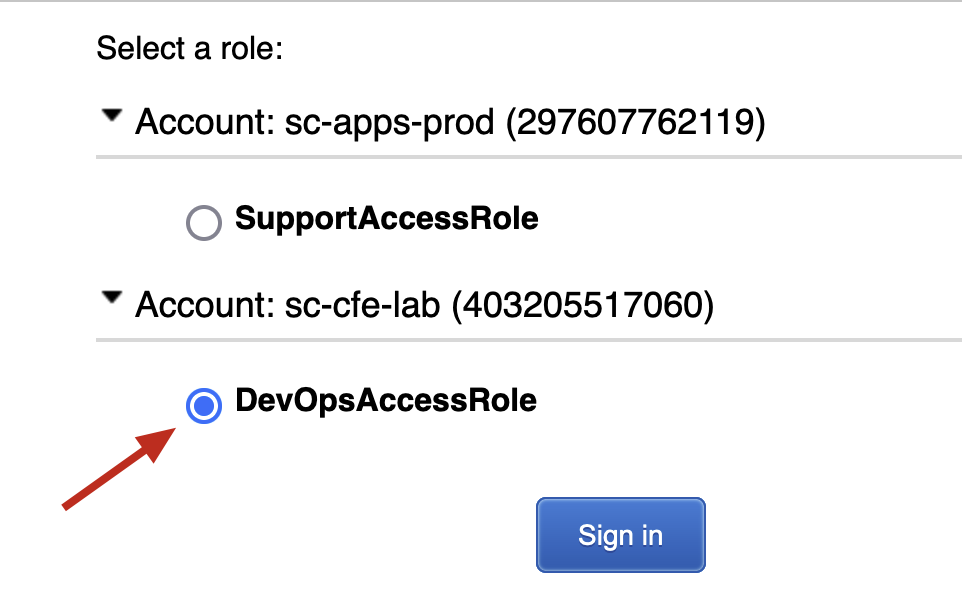
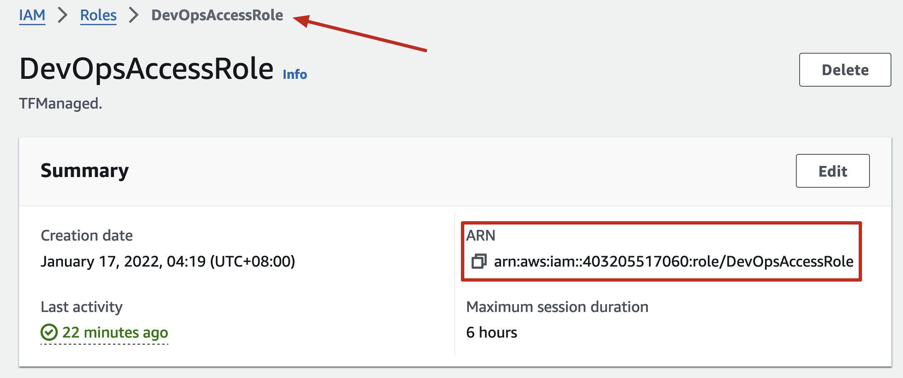
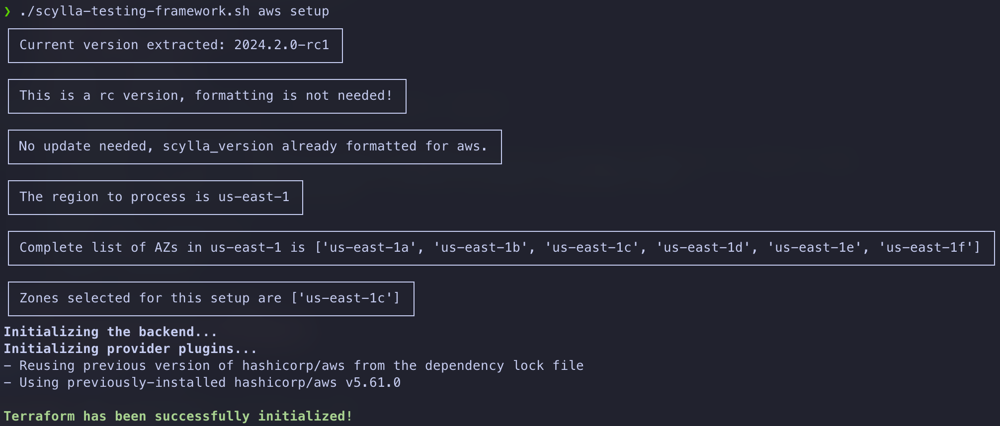
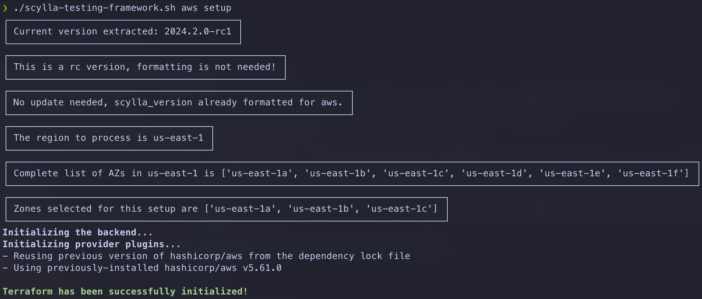
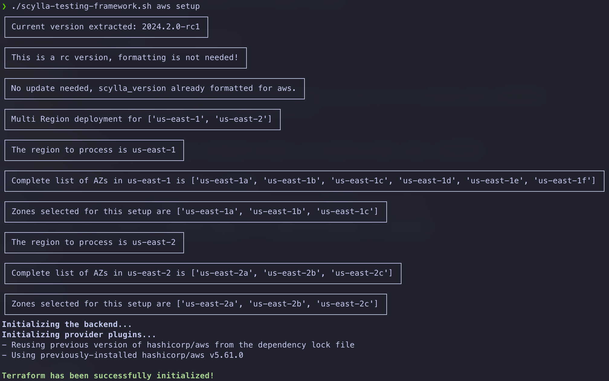
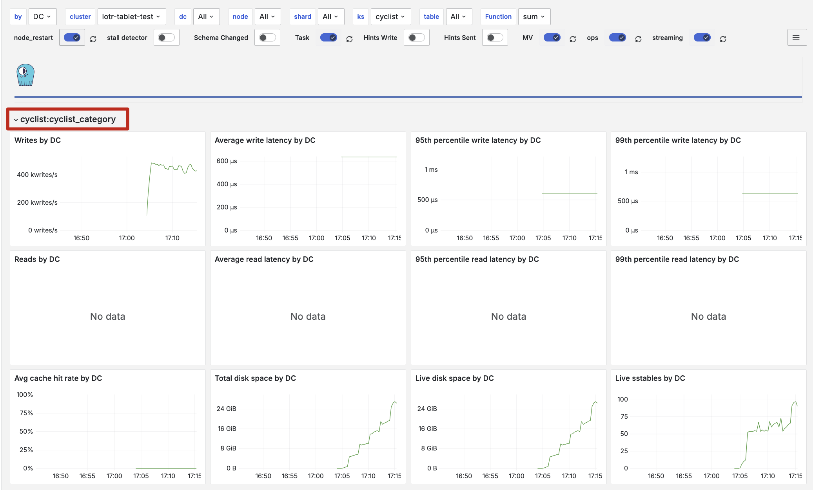
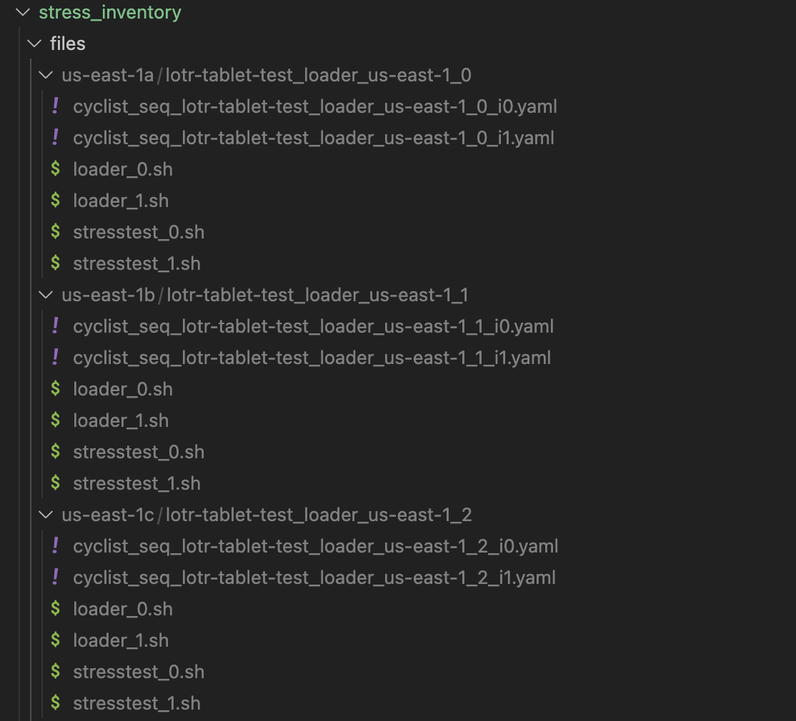
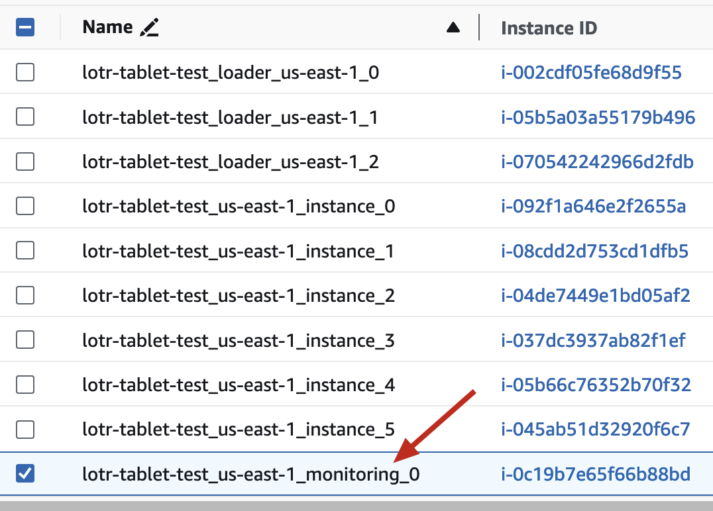
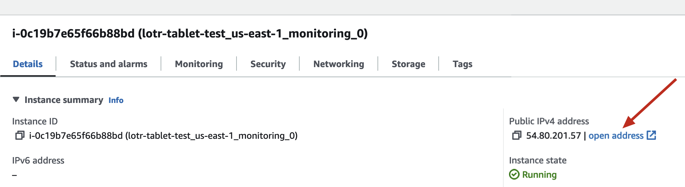
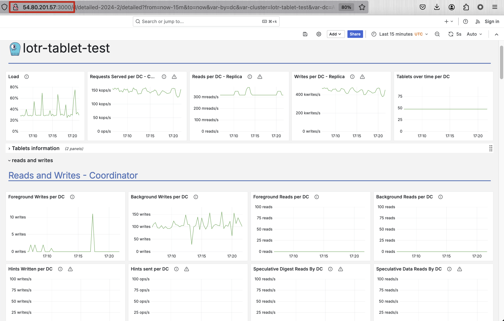

# Scylla SA-CE Testing Framework

This repository contains a script for deploying and managing ScyllaDB instances on cloud platforms such as AWS and GCP. The script supports various operations including setup, configuration, benchmarking, and destruction of cloud resources.

## Features

- **Flexible Version Management**: Dynamically update Scylla version based on cloud provider specifications.
- **Automated Cloud Operations**: Automate the setup and teardown of ScyllaDB clusters with integrated Terraform and Ansible playbooks.
- **Scale-out and Scale-in Capability**: Scale-out and Scale-in the cluster with a single command.
- **Simple connection to Cloud instances**: Automatically creates the SSH scripts to connect to the remote nodes instead of connecting through AWS console on the Web.
- **Benchmarking Tools**: Facilitate stress testing and benchmarking of the ScyllaDB instances.

## Cloning the Repository

When cloning the repository, also clone the submodules and Scylla Ansible Role repository:

```bash
git clone --recurse-submodules git@github.com:scylladb/solutions.git
cd solutions/scylla-sa-testing-framework
```

## Prerequisites

- Bash
- [Python 3](https://www.linuxtuto.com/how-to-install-python-3-12-on-ubuntu-22-04/)
- pip3
  - `sudo apt install python3-pip`
- [Terraform](https://developer.hashicorp.com/terraform/tutorials/aws-get-started/install-cli)
- [Ansible](https://docs.ansible.com/ansible/latest/installation_guide/intro_installation.html#installing-and-upgrading-ansible-with-pipx)
- [AWS CLI](https://docs.aws.amazon.com/cli/latest/userguide/getting-started-install.html) configured (for AWS operations) and key pair available in the region.
- [GCP CLI](https://cloud.google.com/sdk/docs/install) configured (for GCP operations)

### Ansible additional Requirements

Install the necessary Ansible roles using the following commands:

```bash
ansible-galaxy role install geerlingguy.swap
ansible-galaxy role install mrlesmithjr.mdadm
```

## Python Environment Setup

By this time, you should already have `python3` and `pip3` installed, now let's create a virtual environment.

```bash
cd ~
python3 -m venv venv
source ~/venv/bin/activate
```

After this, your `bash` prompt should reflect that you have a virtual environment **activated**. From this point on, everything must be within the same environment. If you logged out and log in again to your terinal you need to **activate the virtual** environment through **`source ~/venv/bin/activate`**

```
(venv) faisal@scylla:~$
```

Change directory to `solutions/scylla-sa-testing-framework` and install the `requirements.txt` by executing **`pip3 install -r requirements.txt`**

```bash
(venv) faisal@scylla:~/work/solutions/scylla-sa-testing-framework$ pip3 install -r requirements.txt
```

The Python virtual environment must be activated through `source ~/venv/bin/activate` This assumes that the virtual environment was created on your profile's home folder `~/`

## GCP Auth

By this time, it is expected that you already have access to the GCP console and a project where billing has been enabled. Once ready with this, connect to the GCP console and your account/project using the following two commands. During this, the default browser will open, and you will have to authenticate using it as a one-time setup

```bash
gcloud auth application-default login
gcloud config set project skilled-adapter-452
```

**Note:** In this case, we can use the project-id 'skilled-adapter-452'_

After successful authentication, you can execute GCP CLI commands `gcloud` and list/create/modify the objects created under your account. 

Test your access through the following; this should list all the compute instances available in your project.

```bash
gcloud compute instances list
```

## AWS Auth

You should have the `DevOpsAccessRole` to get this working. The role names assigned to you can be seen once you login to AWS console throgh OKTA



Follow the instruction here on how to access and assume the role of `DevOpsAccessRole` using this [Notion doc](https://www.notion.so/How-to-login-on-AWS-CLI-and-assume-a-role-bcc4e36042ea4ae9a76ea65e7aafe283) This is very details and has a lot of extra details, to keep it simple follow the next section for to the point  instructions.

### Details

Install `gimme-aws-creds` using `pip3 install --upgrade gimme-aws-creds`. Once gimme-aws-creds is install on your Linux machine create the following config file on your home profile path

`vi ~/.okta_aws_login_config`

```
[DEFAULT]
okta_org_url = https://scylladb.okta.com
okta_auth_server =
# without this key nothing will work
client_id = 0oab7271m7nRkKmlw5d7
gimme_creds_server = appurl
aws_appname =
write_aws_creds = True
cred_profile = acc-role
# CHANGEME: replace it with your email
okta_username = <your.name>@scylladb.com
app_url = https://scylladb.okta.com/home/amazon_aws/0oa2uxps59d96E5Cj5d7/272
resolve_aws_alias = False
include_path = False
remember_device = True
preferred_mfa_type = Okta
aws_default_duration = 21600
output_format =

# EXAMPLE OF PROFILE THAT INHERATES SETTINGS FROM DEFAULT
[sc-cfe-lab]
inherits = DEFAULT
# aws_rolename - can be found in aws app in Okta
aws_rolename = arn:aws:iam::403205517060:role/DevOpsAccessRole
app_url = https://scylladb.okta.com/home/amazon_aws/0oa2uxps59d96E5Cj5d7/272
# Optional: User friendly name of AWS_PROFILE
cred_profile = dbaas-lab-devops
```

- Update `okta_username = <your.name>@scylladb.com` to your ScyllaDB email address
- Update `aws_rolename = arn:aws:iam::403205517060:role/DevOpsAccessRole` based on your account's ARN. This can be extracted from the AWS web console 

  - 

Once configured and saved, test with `gimme-aws-creds -p sc-cfe-lab` command to get creditentials for the `cfe-lab` on AWS. If the `~/.okta_aws_login_config` has been configured correctly, you will see the following for your own user account.

```
❯ gimme-aws-creds -p sc-cfe-lab
Using inherited config: DEFAULT
Okta Classic login flow enabled
Using password from keyring for faisal.saeed@scylladb.com
Multi-factor Authentication required.
Preferred factor type of Okta not available.
Pick a factor:
[0] Okta Verify App: SmartPhone_IPhone: Faisal’s iPhone
[1] Okta Verify App: SmartPhone_IPhone: Faisal’s iPhone
[2] sms: +65 XXXX X771
[3] token:software:totp( GOOGLE ) : faisal.saeed@scylladb.com
[4] token:software:totp( OKTA ) : faisal.saeed@scylladb.com
[5] token:software:totp( OKTA ) : faisal.saeed@scylladb.com
Selection: _
```

Select the way you want to authenticate, #1 is for push notification, the easiest, or you can use 2 for sms based OTP method, up to you.

Here is what to expect

```
Selection: 1
Okta Verify push sent...
Saving arn:aws:iam::403205517060:role/DevOpsAccessRole as dbaas-lab-devops
Written profile dbaas-lab-devops to /Users/faisal.saeed/.aws/credentials
```

The profile has been written as `dbaas-lab-devops` to the credentials doc for my own account. For ease, create the following bash script within your home folder for quickly authenticating to aws

`vi ~/awscred`
```bash
gimme-aws-creds -p sc-cfe-lab
sleep 2
```

Make the file executable by giving minimum privileges possible

```bash
chmod 500 ~/awscred
```

Now executing `./awscred` should be the shortcut to authenticate to AWS and switch your role to `DevOpsAccessRole`, your output may different depending on your `okta` setup.

```
❯ ./awscred
Using inherited config: DEFAULT
Okta Classic login flow enabled
Using password from keyring for faisal.saeed@scylladb.com
Multi-factor Authentication required.
Preferred factor type of Okta not available.
Pick a factor:
[0] Okta Verify App: SmartPhone_IPhone: Faisal’s iPhone
[1] Okta Verify App: SmartPhone_IPhone: Faisal’s iPhone
[2] sms: +65 XXXX X771
[3] token:software:totp( GOOGLE ) : faisal.saeed@scylladb.com
[4] token:software:totp( OKTA ) : faisal.saeed@scylladb.com
[5] token:software:totp( OKTA ) : faisal.saeed@scylladb.com
Selection: _
```

**Once authenticated**, set your credential profile by executing the following on your bash session.

```
export AWS_PROFILE=dbaas-lab-devops
```

You may also want to add this `export AWS_PROFILE=dbaas-lab-devops` to the `.bashrc` or `.zshrc` depending on the shell you use.

### Testing AWS connectivity

Change the directory to `solutions/scylla-sa-testing-framework` and execute a test to see if you are able to access the AWS with your current role setup. This `test` also serves another purpose to list the versions as AMI on the AWS. Supports wildcard search as well. Say we want to see which ScyllaDB AMIs are available on AWS with the name starting with `2024.2`. The input prompt will appear once `./scylla-testing-framework.sh aws test` is executed, key in the appropriate version and it will list all the available versions that match that pattern. Example:

```
❯ ./scylla-testing-framework.sh aws test
As an example
2024.1
2024.2
Please key in the Scylla version to search for AMI: 2024.2
+-------------------------------------------+
| Fetching the list of 2024.2* AMI from AWS |
+-------------------------------------------+
ami-019677598edc8d6ad	ScyllaDB Enterprise 2024.2.0-rc0
ami-01b7d077069a32b52	ScyllaDB Enterprise 2024.2.0-rc1
ami-05244492298da21c0	ScyllaDB Enterprise 2024.2.0-rc1 ARM
ami-0801a5a997f0d1f88	ScyllaDB Enterprise 2024.2.0-rc0 ARM
ami-0de225af2bb2a847c	ScyllaDB Enterprise 2024.2.0-rc2 ARM
ami-0fc20c0763e9dd04d	ScyllaDB Enterprise 2024.2.0-rc2
+-------------------------------------------+
| The AWS connectivity test was successful. |
+-------------------------------------------+

❯ ./scylla-testing-framework.sh aws test
As an example
2024.1
2024.2
Please key in the Scylla version to search for AMI: 2024.1.9
+---------------------------------------------+
| Fetching the list of 2024.1.9* AMI from AWS |
+---------------------------------------------+
ami-03ea19af6a216644b	ScyllaDB Enterprise 2024.1.9
ami-08c1492a1499bc24c	ScyllaDB Enterprise 2024.1.9 ARM
+-------------------------------------------+
| The AWS connectivity test was successful. |
+-------------------------------------------+
```

We can copy the version number, and use it in the `variables.yml` (refer to the next section on how to get `variables.yml`) as `scylla_version: "2024.2.0-rc0"` to have that specific version user for ScyllaDB cluster setup.

## Configuration Files

There are two primary configuration files

- variables.aws.example.yml
- variables.gcp.example.yml

Copy the appropriate config file to `variables.yml`, in the following example, we use the AWS configuration file.

```bash
❯ cp variables.aws.example.yml variables.yml
```

Now you can start to edit the `variables.yml` based on your requirements and proceed.

This YAML file contains all the configurable parameters required by the deployment script. Adjust the settings in variables.yml to tailor the deployment to your needs. Below is an example highlighting some of the key parameters:

```yaml
{
   cluster_name: "my-client-name-dec-31",  # for Faisal Saeed, Zee testing for Sep `FS-Grab-Tablets-Sep-20`
   scylla_version: "2024.2.0-rc2",  # Same version will be used for Loader and ScyllaDB nodes. Faisal, 2024-09-04
   cloud : "aws",
   regions: {
      "us-east-1": {"nodes": 3, 
         "scylla_node_type": "i4i.xlarge",
         "scale_nodes": 3,  # Only for AWS at the moment, 2024-08-08, Set to 0 if scaling is nodes are not required. Faisal. 2024-08-08
         "scylla_scale_node_type": "i4i.xlarge", # Only for AWS at the moment, 2024-08-08, Faisal. 
         "loaders": 3, 
         "loaders_type": "m4.2xlarge",
         "cidr": "10.1.0.0/16",   # Make sure the cidr ranges are unique for both regions in case of a multi-region setup.
         "az_mode": "multi-az"},
         #"az_mode": "single-az"},
      # Optional Second region configuration example if multi-region setup is required
      #   "scylla_node_type": "i4i.xlarge",
      #   "scale_nodes": 3,  # Only for AWS at the moment, 2024-08-08, Set to 0 if scaling is nodes are not required. Faisal. 2024-08-08
      #   "scylla_scale_node_type": "i4i.xlarge", # Only for AWS at the moment, 2024-08-08, Faisal. 
      #   "loaders": 3, 
      #   "loaders_type": "m4.2xlarge",
      #   "cidr": "10.2.0.0/16",   # Make sure the cidr ranges are unique for both regions in case of a multi-region setup.
      #   "az_mode": "multi-az"},
      #   "az_mode": "single-az"},
   },
   # Ensure the following two public and private keys path and names are correct
   path_to_key: "~/.ssh/id_ed25519.pub",
   path_to_private: "~/.ssh/id_ed25519",
   monitoring_type: "m4.2xlarge",
   # The scylla_params block controls which variables are written into the /etc/scylla.yaml file of each of the Scylla node. Faisal, 2024-09-03
   # Don't remove `enable_tablets`, if you don't need tablets, just set it to `false`. Faisal, 2024-09-03
   scylla_params: {
      enable_tablets: true, 
      enable_keyspace_column_family_metrics: true
   },
   stress_setup: {  # Per Loader node setup, Faisal. 2024-08-20
      number_of_loader_threads: 8,
      number_of_loader_instances: 2,   # This defines the number of cassandra-stress initload processes running on each of the Loader nodes
      number_of_stress_threads: 64,
      number_of_stress_instances: 2,   # This defines the number of cassandra-stress stresstest processes running on each of the Loader nodes
      consistency_level: "ONE",
      stress_duration_minutes: "60m",
      desired_node_size: 0.3,   #This is in TB for, say, 200GB use 0.2
      ratio: "1:3",
      select_query: "simple"
   }
}
```

_**Note:** The default `scylla_node_type` has been reduced to a `i4i.xlarge` which has 4 vCPU and less than 1TB of storage per node. If you are planning to test with 1TB or more data, consider using `i4i.2xlarge` (8 vCPU) or `i4i.4xlarge` which has 16 vCPU and 3TB storage. Similarly, consider upgrading the `loaders_type` from `m4.2xlarge` to `m4.4xlarge`._

#### Review of some of the important variables

- `cluster_name: "my-tablet-test"`
  - Ensure that you change this name because the instances created on the cloud will use this name and it may conflict with an existing object by someone else. 
    - Example: `faisal-tablet-test-cluster`
- `"nodes": 3` & `"scylla_node_type": "i4i.4xlarge"`
  - Define the number of Scylla Nodes to be provisioned on the Cloud provider
- `"scale_nodes": 3` & `"scylla_scale_node_type": "i4i.4xlarge"`
  - Defines the number of nodes to scale out to, if this is set to `0`, there will be no scaling for this cluster later, decide before begining the setup.
- `"loaders": 3` & `"loaders_type": "m4.4xlarge"`
  - Defines the number of Scylla Loader nodes to provision which will be configured with Scylla tools `cassandra-stress` and others.
- `path_to_key: "~/.ssh/id_ed25519.pub"` & `path_to_private: "~/.ssh/id_ed25519"`
  These are your local SSH keys that you should have on your Linux/Mac mchines. The public key from this is used to upload to a new AWS keypair automatically, so that we can have direct connection to the AWS nodes without needing to specify any key `ssh -i /path/to/pubic-key`
  - Ansible will use the same keys to connect to the nodes
- `"az_mode": "multi-az"`
  - This defines the nodes creation mode, if it should be deployed on a single AZ within the region or spread across all the available zones. Available options are.
    - `"single-az"` execution
      - A random AZ is selected form the first 3 AZs in the `region`, AZs beyond the first three are ignored as there are hardware type limitations there, for instance, us-east-1 has six AZs but only the first three support `i4i.4xlarge`
      
    - `"multi-az"` execution
      - The first three AZs from the `region` are selected automatically and all the nodes are spread across.
      
- Multi-Region & Multi-AZ setup

  

- `enable_keyspace_column_metrics: true`
  - This enables detailed keyspace level dashboard, set to false, will disable it
  
- `scylla_params:`
  - This contains the actual Scylla parameters that will be placed under the `/etc/scylla/scylla.yaml` file as it is. If there is a typo, the `scylla.yaml` will get the typo as well.
  - Remember to keep the `enable_tablets:` variable there, it's mandatory, all other in this block are optional.
    - If `tablets` are not required, set this to `enable_tablets: false`
- `stress_setup:`
  - The variables under this section are self explanatory. Loader and Stress test scripts will be auto generated based on a fixed profile that can be found under `stress_inventory/cyclist_keyspace.yaml.tp` 
  - Initial loader scripts will be generated, examples of initial load generator and stress test can be found under `stress_inventory/` directory
  - The auto generated loader scripts will be generated based on the `loaders` x `numnbr_of_loader_instances` from the config variables 
  - The auto generated stress test scripts will be generated based on the `loaders` x `numnber_of_stress_instances` from the config variables
  - The `desired_node_size` is important as it controls how many rows will be inserted based on the `loaders` x `numnbr_of_loader_instances`. The default of 1TB is the target and the end result might be a bit more because there are many factors that control the storage size. Verify using the `nodetool status` it should be in the range of 1TB to 1.5TB 
  - These scripts and profiles will be tagged under loader hostname folders and uploaded to the same hosts.
    - AZ1 Loader connects to AZ1 Scylla Instance, AZ2 loaders connect to AZ2 Scylla nodes and so on.
  - Stress Test Generated scripts `az-name -> loader_hostname -> *.yaml; *.sh`

## Usage

The main script is designed to be executed with two arguments specifying the cloud provider and the desired operation. Here are the operations you can perform:

### General Syntax

```bash
./scylla-testing-framework.sh [provider] [operation]
```

#### Supported Providers

* aws: Amazon Web Services
* gcp: Google Cloud Platform

#### Supported Operations

* setup: Initialize and configure the cloud infrastructure and ScyllaDB instances.
* config: Reconfigure existing ScyllaDB instances.
* initload: To start the initial data loading on the cluster *(Only for AWS)*
* stresstest: To start the stress test on the cluster *(Only for AWS)*
* scaling: To scale-out/scale-in the cluster *(Only for AWS)*
* benchmark: Perform benchmarks on the ScyllaDB instances.
* destroy: Remove all cloud resources associated with the ScyllaDB instances.

***Note:** The majority of enhancements to this framework have been done only for AWS, GCP will follow in the future.*

#### Examples

To set up the infrastructure based on the configuration defined in the `variables.yml` and configure replication/monotiring and stress test tools on the loader nodes (Only for AWS)

```bash
# Sets up the infra
./scylla-testing-framework.sh aws setup
```

To start the initial data load on the cluster: (Only for AWS)

```bash
# Sets up the infra
./scylla-testing-framework.sh aws initload
```

To start the stress testing on the cluster: (Only for AWS)

```bash
# Sets up the infra
./scylla-testing-framework.sh aws stresstest
```

To load/stress testing on the cluster: (Only for AWS)

```bash
# Sets up the infra
./scylla-testing-framework.sh aws kilload
```

Once stress test is running, scale-out the cluster. To Scale-out the cluster: (Only for AWS)

```bash
# Sets up the infra
./scylla-testing-framework.sh aws scaleout
```

To Scale-in the cluster: (Only for AWS)

This will decommission the original cluster nodes and keep the scaled out nodes as the cluster.

```bash
# Sets up the infra
./scylla-testing-framework.sh aws scalein
```

These two (scaleout/scalein) will only work if scaling configuration has been specified. This will do a `nodetool decommission` on all the nodes that were added to the cluster using `scaleout` function. After a successful decommission, the nodes data directoery `/var/lib/scylla` will be wiped clean and these nodes are ready to be added back to the cluster using another `scaleout`.

***Note:** Take a closer look at the `scaling` related variables in the confugration file `variables.yml`*

To destroy the Scylla environment on AWS:

```bash
./scylla-testing-framework.sh aws destroy
```

***Note:** The AWS authentication is time based and if your commands start to fail, you will need to execute `~/awscred` again to get fresh authentication*

To destroy the Scylla environment on GCP:

```bash
./scylla-testing-framework.sh gcp destroy
```

To start the Benchmark on GCP:

```bash
./scylla-testing-framework.sh gcp benchmark
```

#### Additional files to finetune

Other than the `variables.yml` file, there are a few other files to take note off. 

- `scylla-testing-framework.sh` the main script to bring all of it together

  ```bash
  ./scylla-testing-framework.sh aws setup
  ./scylla-testing-framework.sh aws initload
  ./scylla-testing-framework.sh aws stresstest
  ./scylla-testing-framework.sh aws kilload
  ./scylla-testing-framework.sh aws scaleout
  ./scylla-testing-framework.sh aws scalein
  ./scylla-testing-framework.sh aws destroy
  ```

These four commands are used to 
- `setup` the infrastructure on AWS and setup Scylla cluster, Monitoring and, Loaders.
  - Additionally, Load generator and Stress test scripts will be created automatically along with the cassandra-stress profile yaml file based on the variables defined under `stress_setup:` section.
- `initload`, `loadtest` on the cluster based on a pre-defined `cassandra-stress` yaml
- `kilload` will terminate all the loader / stress jobs on all the loader nodes in the cluster
- `destroy` the infrastructure once done with testing.

Once `./scylla-testing-framework.sh aws configure` is executed, a new folder is created at the same level where the `scylla-testing-framework.sh` exists, the folder is `ssh_scripts` this folder contains shortcut scripts to `ssh` into all the EC2 nodes created.

```bash
❯ ls -lrt
total 136
drwxr-xr-x@  7 staff  staff    224 Aug  7 19:57 benchmark
drwxr-xr-x@  4 staff  staff    128 Aug  7 19:57 gcp
-rw-r--r--@  1 staff  staff    527 Aug  7 19:57 requirements.txt
-rw-r--r--@  1 staff  staff   1496 Aug  7 19:57 variables.gcp.example.yml
lrwxr-xr-x@  1 staff  staff     25 Aug  7 19:57 variables.yml -> variables.aws.example.yml
-rw-r--r--   1 staff  staff  29738 Aug 11 23:25 main.tf.json
drwxr-xr-x@  5 staff  staff    160 Aug 14 20:29 aws
drwxr-xr-x@  5 staff  staff    160 Aug 15 05:05 stress_inventory
-rwxr-xr-x@  1 staff  staff   7877 Aug 15 14:58 scylla-testing-framework.sh
drwxr-xr-x@ 12 staff  staff    384 Aug 15 15:50 ssh_scripts
-rw-r--r--@  1 staff  staff   1786 Aug 15 17:56 variables.aws.example.yml
drwxr-xr-x@  7 staff  staff    224 Aug 15 20:20 images
-rw-r--r--@  1 staff  staff  15838 Aug 15 22:14 README.md
-rwxr-x---@  1 staff  staff    900 Aug 25 23:34 monitor.sh.tp

❯ cd ssh_scripts
❯ ls -lnrt
total 112
-rwxr-x---@ 1 503  20  36  Aug 18 00:17 scylla_4_2b.sh
-rwxr-x---@ 1 503  20  36  Aug 18 00:17 scylla_4_1b.sh
-rwxr-x---@ 1 503  20  36  Aug 18 00:17 scylla_3_2a.sh
-rwxr-x---@ 1 503  20  34  Aug 18 00:17 scylla_3_1a.sh
-rwxr-x---@ 1 503  20  37  Aug 18 00:17 scylla_2_2c.sh
-rwxr-x---@ 1 503  20  36  Aug 18 00:17 scylla_2_1c.sh
-rwxr-x---@ 1 503  20  37  Aug 18 00:17 scylla_1_2b.sh
-rwxr-x---@ 1 503  20  37  Aug 18 00:17 scylla_1_1b.sh
-rwxr-x---@ 1 503  20  36  Aug 18 00:17 scylla_0_2a.sh
-rwxr-x---@ 1 503  20  38  Aug 18 00:17 scylla_0_1a.sh
-rwxr-x---@ 1 503  20  37  Aug 18 00:17 monitoring_0_1a.sh
-rwxr-x---@ 1 503  20  36  Aug 18 00:17 loader_2_1c.sh
-rwxr-x---@ 1 503  20  36  Aug 18 00:17 loader_1_1b.sh
-rwxr-x---@ 1 503  20  37  Aug 18 00:17 loader_0_1a.sh
-rwxr-x---@ 1 503  20  491 Aug 25 23:34 run
```

The first three "scylla" scripts are to `ssh` to the primary cluster nodes, the scylla_3 to scylla_5 are for the scaled nodes. We can already `ssh` to these nodes but `scylla-server` service won't be running there. 

The loader_0 to loader_2 nodes on AWS are to ssh into the Cassandra Stress running loader machines. The nodes will contain three two scripts.

The suffix of `1a` vs `2a` reffers to the region, we will see a `scylla_0_1a.sh` and `scylla_0_2a`.sh at the same time in a `multi-region` setup.

##### The **`run`**

The `run` is a handy script under the `ssh_scripts` folder. It will let you execute commands on the all the remote nodes of the specific type without connecting to those nodes. For example.

```
./run loader ls -lrt
./run scylla nodetool status
```

##### The **`monitor.sh`**

This script gets generated from `monitor.sh.tp` and it will let you open up the browser pointing to the monitoring of your cluster. The IP gets generated when the `ssh_scripts` are being generated. It is ready for MacOS, Linux environments. 

### Running initial load / stress test

Running the initial load or the stress test are very simple. 

```bash
./scylla-testing-framework.sh aws initload
./scylla-testing-framework.sh aws stresstest
```

The configuration that effect these jobs are following block from the `variables.yml` 

```
   stress_setup: {  # Per Loader node setup, Faisal. 2024-08-20
      number_of_loader_threads: 16,   
      number_of_stress_threads: 100,
      number_of_loader_instances: 2,
      number_of_stress_instances: 2,
      consistency_level: "ONE",
      stress_duration_minutes: "60m",
      desired_node_size: 1,   #This is in TB
      ratio: "1:3",
      select_query: "simple"
   }
```

The `number_of_loader_instances` and `number_of_stress_instances` variables also control, how many cassandra-stress profiles will be created, such as the following files will be generated if `number_of_loader_instances: 3` and `number_of_stress_instances: 5` was used.

```
-rw-rw-r-- 1 parallels parallels 384 Aug 23 04:21 stresstest_4.sh
-rw-rw-r-- 1 parallels parallels 384 Aug 23 04:21 stresstest_3.sh
-rw-rw-r-- 1 parallels parallels 384 Aug 23 04:21 stresstest_2.sh
-rw-rw-r-- 1 parallels parallels 384 Aug 23 04:21 stresstest_1.sh
-rw-rw-r-- 1 parallels parallels 384 Aug 23 04:21 stresstest_0.sh
-rw-rw-r-- 1 parallels parallels 381 Aug 23 04:21 loader_2.sh
-rw-rw-r-- 1 parallels parallels 381 Aug 23 04:21 loader_1.sh
-rw-rw-r-- 1 parallels parallels 381 Aug 23 04:21 loader_0.sh
-rw-rw-r-- 1 parallels parallels 762 Aug 23 04:21 cyclist_seq_lotr-tablet-test_loader_us-east-1_0_i4.yaml
-rw-rw-r-- 1 parallels parallels 762 Aug 23 04:21 cyclist_seq_lotr-tablet-test_loader_us-east-1_0_i3.yaml
-rw-rw-r-- 1 parallels parallels 762 Aug 23 04:21 cyclist_seq_lotr-tablet-test_loader_us-east-1_0_i2.yaml
-rw-rw-r-- 1 parallels parallels 762 Aug 23 04:21 cyclist_seq_lotr-tablet-test_loader_us-east-1_0_i1.yaml
-rw-rw-r-- 1 parallels parallels 752 Aug 23 04:21 cyclist_seq_lotr-tablet-test_loader_us-east-1_0_i0.yaml
```

The `cyclist_seq_lotr-tablet-test_loader_us-east-1_0_i0.yaml` file will have the following 

```yaml
keyspace: cyclist

keyspace_definition: |
  CREATE KEYSPACE cyclist WITH replication = {'class': 'NetworkTopologyStrategy', 'replication_factor': 3} AND tablets = {'enabled': true};

table: cyclist_category

table_definition: |
  CREATE TABLE cyclist.cyclist_category (
    category text,
    points int,
    id uuid,
    lastname text,
    PRIMARY KEY (category, points)
  );

columnspec:
  - name: category
    size: uniform(50..200)
    population: seq(0..10000000000)
  - name: points
    population: uniform(1..10000000)
  - name: id
  - name: lastname
    size: uniform(50..100)

insert:
  partitions: fixed(1)
  batchtype: UNLOGGED

queries:
  simple:
    cql: select * from cyclist_category where category = ? and points = ?
    fields: samerow
```

The `population: seq(0..10000000000)` will differ for each profile with an increment based on `desired_size` value and the `select_query: "simple"` in the `variables.yml` points to the `queries` block. If you wish to use another complex query, define it in the template which can be found under the `stress_inventory/cyclist_keyspace.yaml.tp` Try not to change anything else :) 

```yaml
queries:
  simple:
    cql: select * from cyclist_category where category = ? and points = ?
```

If, lets say, we execute the `initload` job with the above configuration. This will mean that there will be three shell scripts running with `cassandra-stress` commands as follows based on `number_of_loader_instances: 2` value. The `threads=16` follow `number_of_loader_threads: 16` and `n=10000000000` following `population_step: 10000000000` from the config. 


```bash
nohup cassandra-stress user profile=cyclist_seq_lotr-tablet-test_loader_us-east-1_0_i0.yaml n=10000000000 'ops(insert=1)' no-warmup -rate threads=16 -node 10.1.0.180 -port native=9042 > $log_file 2>&1 &
echo 'tail -f scylla_loader_1_$(date "+%Y-%m-%d_%H%M%S").log' > loader_log_1.sh

nohup cassandra-stress user profile=cyclist_seq_lotr-tablet-test_loader_us-east-1_0_i1.yaml n=10000000000 'ops(insert=1)' no-warmup -rate threads=16 -node 10.1.0.180 -port native=9042 > $log_file 2>&1 &
echo 'tail -f scylla_loader_1_$(date "+%Y-%m-%d_%H%M%S").log' > loader_log_1.sh
```

Similarly the stress test scripts will follow `number_of_stress_instances: 2`, duration, read/write ratios, threads will follow the configuration accordingly.

```bash
nohup cassandra-stress user profile=cyclist_seq_lotr-tablet-test_loader_us-east-1_0_i0.yaml duration=60m 'ops(insert=1,simple=3)' no-warmup -rate threads=100 -node 10.1.0.180 -port native=9042 > $log_file 2>&1 &
echo 'tail -f stresstest_1_$(date "+%Y-%m-%d_%H%M%S").log' > stress_log_1.sh

nohup cassandra-stress user profile=cyclist_seq_lotr-tablet-test_loader_us-east-1_0_i1.yaml duration=60m 'ops(insert=1,simple=3)' no-warmup -rate threads=100 -node 10.1.0.180 -port native=9042 > $log_file 2>&1 &
echo 'tail -f stresstest_1_$(date "+%Y-%m-%d_%H%M%S").log' > stress_log_1.sh
```

If, say, we change the configuration while the load or stresstest is already running, we can simply trigger the job again and it will kill all existing jobs on all the loaders and then rerun based on the updated parameters. The scripts generated for this can be found under `stress_inventory/files` as shown here.



### Monitoring Dashboard

Once the `initload` or `stresstest` are running, we can access the Monitoring dashboard. Jump to the aws web console and go to the EC2 dashboard and search for the "monitoring_0" instance.



Click on it to view the detais pannel, and click on the public ip to open it up in a broaser new browser tab.



The dashaobard will not open because the monitoring service is running on the port `3000` and it's `http` not `https`. Make these changes to the address, keeping the IP intact. 



#### Setting Up Multiple Regions

The regions section of the `variables.yml` file allows you to configure multiple regions for deployment. Each region can have its own set of configurations such as the number of nodes, node type, disk size, and networking settings. This flexibility helps in customizing the deployment based on geographic requirements and resource availability.

### Pulling latest build

Always make sure to **DESTROY** your current setup before pulling the new build from github.

```bash
./scylla-testing-framework.sh aws destroy
```
